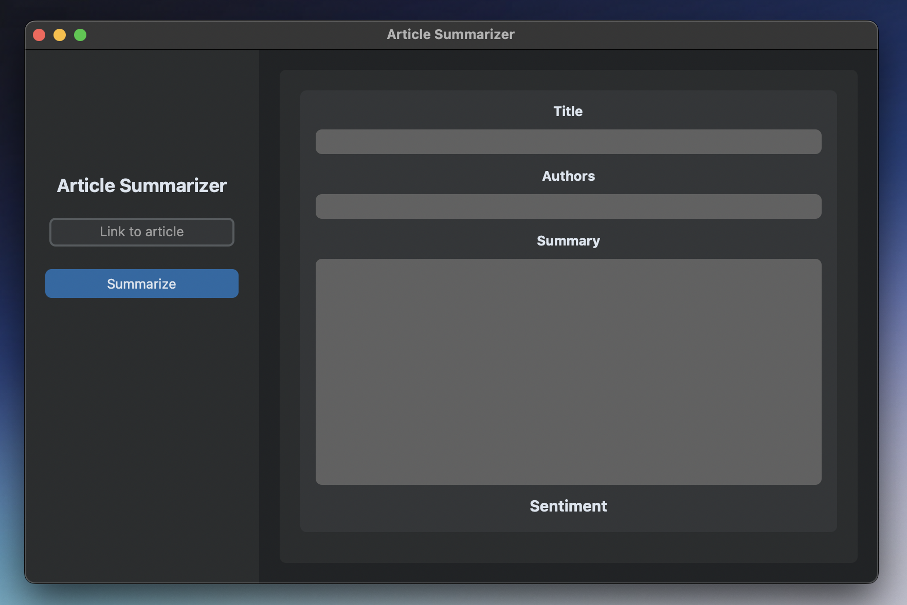
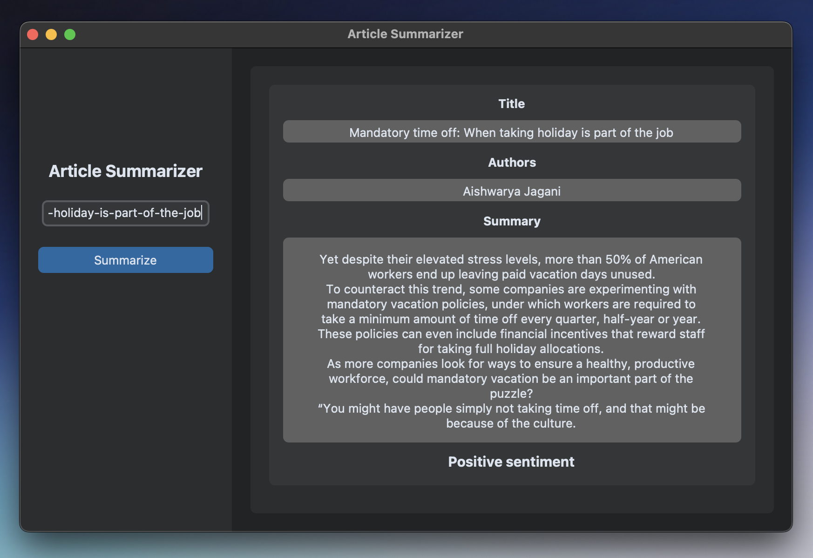

# Article summarizer and sentiment checker in Python GUI app
This app lets you summarize an article and find its sentiment using easy to implement Machine Learning function and has nice and modern GUI made with Customtkinter module in Python

## Technologies Used
- Python 3.9
- Python customtkinter, nltk, textblob and newspaper modules 

## Screenshots

## Setup
Python 3.x installed and 'pip install' all of modules listed above

## Contact
Feel free to contact me at kontakt.mblaszczykowski@gmail.com
